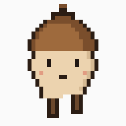
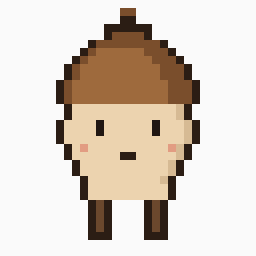

# pixel-sprite-animator

One 32x32 idle sprite in. A complete animated character out: breathing idle with a personality beat, an articulated walk cycle, per-frame PNGs, a spritesheet, a manifest, and preview GIFs.

**Zero AI at runtime.** Every frame is a deterministic pixel transform.




## Why no AI in the animation step

I tried the AI version first. Image models are straight-ahead animators with zero memory: ask one for four walk frames and you get four amnesiac drawings of someone who looks mostly like your character. Identity drifts, the hat changes angle, the motion reads as wobbling. An earlier version of this pipeline generated walk poses with an image model and spent most of its code defending against that drift — masks, palette locks, drift scoring, retries.

Then I replaced the model with a rig, and the rig version reads better at 32x32. The insight is that at this resolution, a walk is small: the back leg plants one pixel forward, the front leg lifts one pixel, the body rises one pixel on the passing beat. You don't need a model to imagine that. You need anatomy in known rows.

## What it generates

| Frame | Transform |
|---|---|
| `idle_0` | the source sprite, verbatim. Sacred — everything derives from it |
| `breath` | torso rows lift 1px, head and feet stay planted (internal motion, not a bouncing PNG) |
| `walk_passing` | whole body lifts 1px — both feet off the ground between strides |
| `contact_L` / `contact_R` | back leg plants forward, front leg lifts — asymmetric, alternating |
| `signature` | the creature's personality beat (see below) |

The walk plays as the classic A-B-A-C contact/passing pattern at 6fps; the idle is a 4fps breath rhythm punctuated once per loop by the signature action. Both ship as named sequences in `manifest.json`, so a game engine plays patterns, not frame indices.

## Signature actions

Each creature declares one personality frame in an optional `META.yaml`:

```yaml
signature_action: sparkle   # bow | hat_tilt | sparkle | twinkle | steam
signature_spot: [26, 6]     # where the effect appears
has_visible_legs: true      # false = robed/round creature, walk becomes a body sway
```

The wizard's wand sparks. The scholar tilts their hat. The baker's loaf steams. It's one frame, and it's the difference between a creature that's alive and a PNG that breathes.

## Usage

```bash
pip install numpy pillow pyyaml

# try the included demo creature
python3 examples/make_demo_sprite.py
python3 sprite_animator.py --source examples/acorn_kid/source_idle.png \
                           --out examples/acorn_kid --name acorn_kid
```

Your own sprites need to follow the rig contract — feet on row 29, head in the top 13 rows, facing right. The full contract (and how to adapt it to other sizes) is in [POSE_TEMPLATE.md](POSE_TEMPLATE.md). Transparent or magenta backgrounds both work; magenta is keyed automatically.

## Who made this

Kyle Miller. This is the creature-animation layer extracted from my game projects, where it animates a bestiary of dozens of sprites without a single per-frame drawing. More: [themisfoundry.com](https://themisfoundry.com)

## License

MIT — code. The demo sprite is generated by `examples/make_demo_sprite.py`, so the example assets are MIT too.
